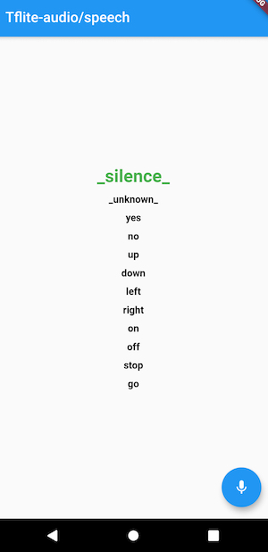

# flutter_tflite_audio

This plugin allows you to use tflite to make audio/speech classifications. Can now support ios and android. 

If there are any problems with the plugin, please do not hesistate to create an issue or request features on github.




## Limitations of this plugin and roadmap

1. Can only use decoded wave for the tensor input. Will add an ability to use mfcc in the future.
2. Can only run the model once after recording. Will add a feature to run the model multiple times or indefintely the user's specification.
3. Fixed tensor input and output shape. Perhaps will add a feature where this can be shaped. 

## How to add tflite_audio as a dependency:
1. Add `tflite_audio` as a [dependency in your pubspec.yaml file]


## How to add tflite model and label to flutter:
1. Place your custom tflite model and labels into the asset folder. 
2. In pubsec.yaml, link your tflite model and label under 'assets'. For example:

```
  assets:
    - assets/conv_actions_frozen.tflite
    - assets/conv_actions_labels.txt

```

## How to use this plugin
Please look at the [example](https://github.com/Caldarie/flutter_tflite_audio/tree/master/example) on how to implement these futures.


1. Import the plugin. For example:

```
import 'package:tflite_audio/tflite_audio.dart';
```


2. To load your model, bascially call the the future loadModel() and assign the appropriate values to the arguments like below:


```dart
//Create a future from the plugin as shown below:
 Future loadModel({model, label, numThreads, isAsset}) async {
    return await TfliteAudio.loadModel(model, label, numThreads, isAsset);
  }
```

```dart
//Assign the values and then call the future as shown below
loadModel(
        model: "assets/conv_actions_frozen.tflite",
        label: "assets/conv_actions_labels.txt",
        numThreads: 1,
        isAsset: true);
```


3. To get the results, call the future startAudioRecognition and assign the appropriate values to the arguments. For example:

```dart
//Create a future from the plugin as shown below
  Future<Map<dynamic, dynamic>> startAudioRecognition(
      {int sampleRate, int recordingLength, int bufferSize}) async {
    return await TfliteAudio.startAudioRecognition(
        sampleRate, recordingLength, bufferSize);
  }

```

```dart
//Assign the future to map as shown below. 
//Remember to assign the appropriate values.
  Map<dynamic, dynamic> result = await startAudioRecognition(
            sampleRate: 16000, recordingLength: 16000, bufferSize: 1280);

//use following keys to get the result you want from the map. Such as:
  var recognitionResult = result['recognitionResult'] 
  var inferenceTIme = result['inferenceTime']
  var hasPermission = result['hasPermission']
```

4. For a rough guide on the parameters

```
numThreads - higher threads will reduce inferenceTime. However, cpu usage will be higher.

sampleRate - determines the number of samples per second

recordingLength - determines the max length of the recording buffer. 
If the value is not below or equal to your tensor input, it will crash.

bufferSize - Make sure this value is equal or below your recording length. 
A very high value may not allow the recording enough time to capture your voice. 
A lower value will give more time, but it'll be more cpu intensive
Remember that this value varies depending on your device.
    
```    

## Android Installation & Permissions
Add the permissions below to your AndroidManifest. This could be found in  <YourApp>/android/app/src folder. For example:

```
<uses-permission android:name="android.permission.RECORD_AUDIO" />
<uses-permission android:name="android.permission.WRITE_EXTERNAL_STORAGE" />
```

Edit the following below to your build.gradle. This could be found in <YourApp>/app/src/For example:

```
aaptOptions {
        noCompress 'tflite'
```

## iOS Installation & Permissions
1. Add the following key to Info.plist for iOS. This ould be found in <YourApp>/ios/Runner
```
<key>NSMicrophoneUsageDescription</key>
<string>Record audio for playback</string>
```

2. Change the deployment target to at least 12.0. This could be done by:

    a. Open your project workspace on xcode
  
    b. Select root runner on the left panel
  
    c. Under the info tab, change the iOS deployment target to 12.0
    

3. Open your podfile in your iOS folder and change platform ios to 12. Also make sure that use_frameworks! is under runner. For example

```
platform :ios, '12.0'
```

```ruby
target 'Runner' do
  use_frameworks! #Make sure you have this line
  use_modular_headers!

  flutter_install_all_ios_pods File.dirname(File.realpath(__FILE__))
end
```

## References

https://github.com/tensorflow/examples/tree/master/lite/examples/speech_commands
